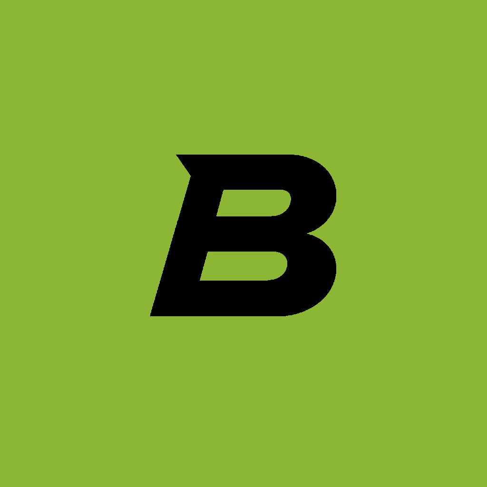

# Bitácora

**Tus entrenos y tus comidas, en una sola app.**

Sin cuenta, sin anuncios y sin conexión. Todo lo que registras se queda en tu
teléfono.

---

## La idea

Llevar el gimnasio en una app y la comida en otra significa apuntar dos veces y
no ver nunca el conjunto. Bitácora junta las dos mitades: lo que levantas y lo
que comes, en el mismo calendario.

Funciona sin internet, porque en el gimnasio casi nunca hay cobertura. Solo se
conecta cuando buscas un alimento nuevo.

---

## 🏋️ Entrenar

**Apunta la serie y sigue.** Reps, kilos, un toque para marcarla como hecha. Al
lado de cada serie ves lo que hiciste **la última vez**, así sabes si estás
repitiendo o mejorando sin salir de la pantalla.

**El descanso se cuenta solo.** Marcas la serie y arranca el cronómetro con los
segundos que hayas puesto para ese ejercicio.

**Rutinas.** Monta tu día de pecho una vez y empiézalo con un botón. Puedes
programarlas por días de la semana o cada X días, y la que toca hoy te espera en
la pantalla de inicio. Para pasarle una a un amigo, enséñale su código QR: lo
escanea desde su app y la tiene igual, sin cuentas de por medio.

**Récords.** La app se queda con tus mejores marcas de cada ejercicio: el peso
más alto, la serie más dura y tu máximo estimado. Cuando una serie bate una de
ellas, aparece una medalla y te lo dice en el momento.

**1.324 ejercicios** con animación, músculo que trabajan, material que necesitan
e instrucciones. Busca por nombre o filtra por grupo muscular. Y si haces algo
que no está en la lista, lo añades tú.

**Todo queda guardado.** Cada entreno con su fecha, su duración y todas las
series que hiciste. Si un día apuntaste mal, se corrige.

---

## 🍎 Comer

**Desayuno, comida, cena y snacks.** Cada comida con sus calorías y el total del
día frente a tu objetivo.

**Escanea el código de barras** del envase y listo. Los productos salen de
**Open Food Facts**, una base de datos pública de alimentos con millones de
referencias. Si no tiene código o la cámara no ayuda, lo tecleas.

**Lo que repites está a un toque.** La app busca primero entre los alimentos que
ya usas, guarda los que escaneas y te deja **repetir la comida de ayer** entera.

**No hace falta que sepas cuántas calorías comer.** Le dices tu género, edad,
altura, peso y cuántos kilos quieres ganar o perder por semana, y te propone un
objetivo con sus proteínas, carbohidratos y grasas. Si le pides un ritmo
demasiado agresivo, te lo baja y te avisa.

---

## 📈 Ver el progreso

**Un calendario con tu mes.** Los días que entrenaste, los que apuntaste la
comida, los que tenías rutina programada y los de descanso.

**Rachas.** Una llama que crece cuantos más días seguidos llevas, y un anillo que
se va llenando hacia la siguiente meta: 3 días, 7, 14, 30…

**El descanso no te castiga.** Marcas qué días de la semana descansas, o marcas
uno suelto, y la racha sigue viva. Dos días seguidos sin entrenar sí la cortan.

**Tu peso, en una línea.** Con tu objetivo marcado y cuánto te falta para
llegar.

**Cómo va cada ejercicio.** El peso que mueves en press banca, sesión a sesión.

**Tus datos son tuyos.** Puedes exportarlo todo a un archivo y recuperarlo
cuando quieras, en este móvil o en otro.

---

## Créditos

Los **ejercicios** vienen del dataset público
[hasaneyldrm/exercises-dataset](https://github.com/hasaneyldrm/exercises-dataset),
cuyos datos son MIT.

Las **imágenes y animaciones de los ejercicios** son propiedad de
[**Gym visual**](https://gymvisual.com/), que permite usarlas a un máximo de
180×180 píxeles y **exigiendo la atribución**. Por eso no se incluyen en la app:
se descargan al verlas y la app muestra el crédito «© Gym visual —
gymvisual.com» junto a cada una. Si vas a publicar algo basado en este
repositorio, revisa esos términos antes.

Los **datos de alimentos** son de [Open Food Facts](https://world.openfoodfacts.org),
base de datos colaborativa bajo licencia ODbL.

El **código de Bitácora** es libre, con [licencia MIT](LICENSE). Esa licencia
cubre el código: los materiales de terceros de arriba se rigen por los suyos.

---

¿Quieres instalarla, trastear el código o aportar?
**[Guía de desarrollo →](docs/DESARROLLO.md)**

